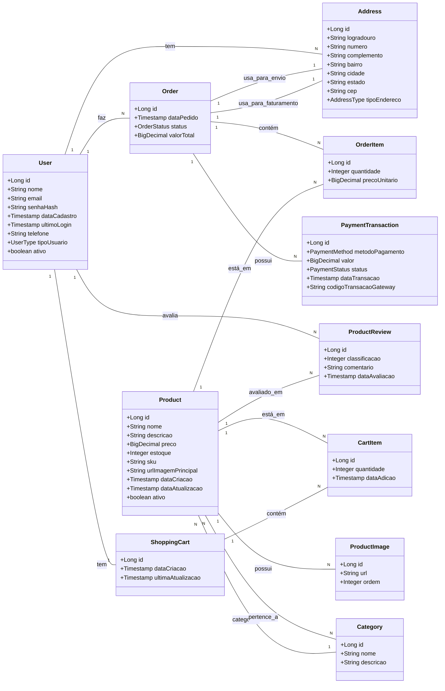

# e-commerce-api
Contribuição para o desafio de projeto do bootcamp

```mermaid
classDiagram
    direction LR

    class User {
        +Long id
        +String nome
        +String email
        +String senhaHash
        +Timestamp dataCadastro
        +Timestamp ultimoLogin
        +String telefone
        +UserType tipoUsuario
        +boolean ativo
    }

    class Address {
        +Long id
        +String logradouro
        +String numero
        +String complemento
        +String bairro
        +String cidade
        +String estado
        +String cep
        +AddressType tipoEndereco
    }

    class Product {
        +Long id
        +String nome
        +String descricao
        +BigDecimal preco
        +Integer estoque
        +String sku
        +String urlImagemPrincipal
        +Timestamp dataCriacao
        +Timestamp dataAtualizacao
        +boolean ativo
    }

    class Category {
        +Long id
        +String nome
        +String descricao
    }

    class ProductImage {
        +Long id
        +String url
        +Integer ordem
    }

    class ProductReview {
        +Long id
        +Integer classificacao
        +String comentario
        +Timestamp dataAvaliacao
    }

    class Order {
        +Long id
        +Timestamp dataPedido
        +OrderStatus status
        +BigDecimal valorTotal
    }

    class OrderItem {
        +Long id
        +Integer quantidade
        +BigDecimal precoUnitario
    }

    class PaymentTransaction {
        +Long id
        +PaymentMethod metodoPagamento
        +BigDecimal valor
        +PaymentStatus status
        +Timestamp dataTransacao
        +String codigoTransacaoGateway
    }

    class ShoppingCart {
        +Long id
        +Timestamp dataCriacao
        +Timestamp ultimaAtualizacao
    }

    class CartItem {
        +Long id
        +Integer quantidade
        +Timestamp dataAdicao
    }

    %% Relacionamentos
    User "1" -- "N" Address : tem
    User "1" -- "N" Order : faz
    User "1" -- "N" ProductReview : avalia
    User "1" -- "1" ShoppingCart : tem

    Order "1" -- "N" OrderItem : contém
    Order "1" -- "N" PaymentTransaction : possui
    Order "1" -- "1" Address : usa_para_envio
    Order "1" -- "1" Address : usa_para_faturamento

    Product "1" -- "N" ProductImage : possui
    Product "1" -- "N" ProductReview : avaliado_em
    Product "1" -- "N" OrderItem : está_em
    Product "1" -- "N" CartItem : está_em

    Category "1" -- "N" Product : categoriza
    Product "N" -- "N" Category : pertence_a

    ShoppingCart "1" -- "N" CartItem : contém
```
